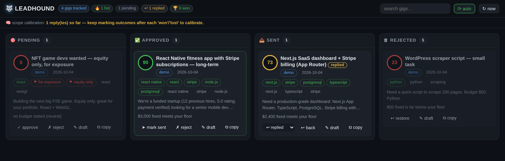
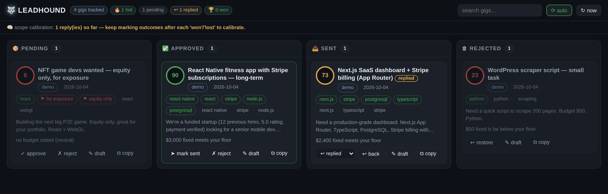

<div align="center">

# 🐺 leadhound

**The gig sniper.** Watches freelance job boards 24/7, scores every gig against
*your* profile, and drafts the proposal **in your voice** — you just approve and send.

*In freelancing, speed wins. The first five proposals on a fresh gig get
disproportionate replies. leadhound makes sure you're always among them —
even at 3am.*

[](https://github.com/e2sy/leadhound/actions/workflows/ci.yml)
[](LICENSE)
[](pyproject.toml)
[](pyproject.toml)
[](CONTRIBUTING.md)

`pip install -e .` · Local-first · SQLite · No accounts · No telemetry · Native binaries for Win/Mac/Linux

**[Quickstart](#-quickstart) · [How it works](#-how-it-works) · [Telegram in 2 minutes](#-telegram-in-2-minutes) · [FAQ](#-faq) · [Roadmap](#-roadmap)**

</div>

---

<p align="center">
  
</p>

<p align="center">
  <em>Approve → send → mark outcomes. The board is your entire pipeline, one command away: <code>leadhound web</code></em><br>
  
</p>

## ⚡ Quickstart

```bash
git clone https://github.com/e2sy/leadhound && cd leadhound
pip install -e .

leadhound init      # creates ~/.leadhound with config + profile
# -> edit ~/.leadhound/profile.toml  (skills, rates, proof bullets)
# -> edit ~/.leadhound/config.toml   (sources, Telegram, Discord/Slack, LLM)

leadhound doctor    # pre-flight check: config, profile, feeds, db
leadhound demo      # offline test: injects sample gigs (incl. red-flag traps)
leadhound queue     # review: approve / reject — drafts ready to send
leadhound digest    # morning briefing: the best gigs from the last 24h
leadhound web       # dashboard: kanban pipeline + draft editor in your browser

leadhound watch                  # go live: poll real job feeds once
leadhound watch --loop           # or keep watching on an interval
leadhound watch --min-score 80   # only the cream
leadhound telegram               # push gig cards to your phone
leadhound webhooks               # push gig cards to Discord / Slack
leadhound profile learn e2sy     # scan your GitHub, auto-tune the skills list
leadhound export --format csv    # your pipeline, out to a spreadsheet
leadhound mark 42 won            # record outcomes — the scope learns 🐺
```

**60-second demo with zero setup:** `leadhound demo && leadhound queue` — works fully offline. Want the visual? `leadhound demo && leadhound web` opens a dark kanban dashboard of your whole pipeline. These are the exact paths the launch video uses.

## 😩 The problem

Freelance job hunting is a *speed game played while you sleep*:

- Best gigs get 30+ proposals within hours — late proposals are noise
- Checking five boards manually, five times a day, doesn't scale
- 90% of posted gigs don't fit your stack or insult your rate — but you read them all anyway
- Writing a fresh, non-generic proposal for the one gig that *does* fit takes 20 minutes you don't have

leadhound replaces all of that with one local watcher that never sleeps and a voice engine that never writes generic fluff.

## 🎯 How it works

```
[WATCHERS]  ──>  [PARSER]  ──>  [SCORER]  ──>  [VOICE ENGINE]
  RSS feeds       extract        fit score       proposal draft
  + job APIs      skills,        0-100 +         in YOUR voice,
                  money,         breakdown       with YOUR proof
                  red flags      ("why 92?")     bullets + tone
                                                      |
                                              [APPROVAL QUEUE]
                                              Telegram / CLI
                                              you tap. you send.
```

| Stage | What it does |
|---|---|
| **Watchers** | Pluggable connectors. Ships ToS-friendly public feeds: WeWorkRemotely (RSS), RemoteOK (public API), Remotive (public API), Hacker News (public Algolia API — the monthly freelancer thread, demand-side posts only). |
| **Parser** | Regex signal extraction: money (hourly / fixed / ranges), client-quality signals (payment verified, past hires, top-rated), red flags, skill matching. |
| **Scorer** | `skills 0-60 · budget 0-25 · client quality 0-15 · red flags -15 each`. Every gig ships with a human-readable breakdown: *"58 — matched react, typescript; no budget stated (neutral)"*. |
| **Voice engine** | Template mode works with zero config. Or plug any OpenAI-compatible endpoint (OpenAI, Groq, OpenRouter, local Ollama) and it ghostwrites in your tone, trained on your past winning proposals. |
| **Approval queue** | Rich CLI queue or Telegram/Discord/Slack cards. **You always fire the final shot.** leadhound is a radar + copilot, *not* an auto-bidder. |
| **Client intel** | Cross-references your own gig history: repeat posters and repeat lowballers get flagged before you spend a minute on the draft. |
| **Learning loop** | `leadhound mark <id> won/lost/replied` → stats calibrate: winners vs losers by score, with hints to tighten your scope. The tool gets sharper the longer you hunt. |
| **Web dashboard** | `leadhound web` — a local, zero-dependency kanban board of your pipeline: drag gigs pending → approved → sent, edit drafts in-browser, mark outcomes, live search. Binds to 127.0.0.1 (or `--host 0.0.0.0` to drive it from your phone). |
| **GitHub recon** | `leadhound profile learn <you>` — scans your public repos, ranks the languages/topics you actually ship, and merges them into your skills list. Zero-config personalization. |
| **Data export** | `leadhound export --format csv\|json` — your whole gig history as clean rows for spreadsheets, scripts or your CRM. No lock-in. |

## 🛡️ ToS-safe by design

Platforms ban bots that log in, scrape logged-in pages, and auto-send. leadhound deliberately does none of that:

- ✅ Reads **public** feeds/APIs only, with a polite `User-Agent`
- ✅ Polls at **human-rate** intervals (default 15 min)
- ✅ **Never submits anything** — you review and send every proposal yourself
- ❌ No auto-bidding, no headless-browser scraping, no account automation

It makes you faster — not banned.

## 📱 Telegram in 2 minutes

1. Talk to [@BotFather](https://t.me/BotFather) → `/newbot` → copy the token
2. Message your bot once, then open `https://api.telegram.org/bot<TOKEN>/getUpdates` → copy `chat.id`
3. Fill `[telegram]` in `~/.leadhound/config.toml`, set `enabled = true`

Now every gig above your threshold buzzes your pocket with the draft attached — approve on your phone, send from your laptop.

Prefer Discord or Slack? Drop a webhook URL into `[webhooks]` in `config.toml` and the same gig cards land in your server the moment the watcher sees them.

## 🧠 LLM voice mode (optional)

```toml
[llm]
enabled = true
base_url = "https://api.groq.com/openai/v1"   # or OpenAI, OpenRouter, Ollama
api_key = "gsk_..."
model = "llama-3.3-70b-versatile"
```

Drop 1-3 of your past winning proposals into `profile.toml → tone_samples`.
The ghostwriter copies your structure and tone, capped at 150 words, and is
forbidden from inventing experience. If the API fails, it silently falls back
to template mode — the pipeline never breaks.

## ⚙️ Configuration reference

| File | Purpose |
|---|---|
| `~/.leadhound/profile.toml` | **Your sniper profile**: skills, rate floors, red flags, proof bullets, tone samples. The scorer is only as sharp as this file. |
| `~/.leadhound/config.toml` | Watch settings (`min_score`, `interval_minutes`, `sources`), optional LLM + Telegram. |
| `~/.leadhound/data/leadhound.db` | SQLite. Your entire gig history, local-only, yours. |

See [`examples/profile.example.toml`](examples/profile.example.toml) for a filled-in profile.

## 🚀 Extending: add a watcher in 30 lines

```python
# leadhound/watchers/mysource.py
def mysource() -> list[dict]:
    ...
    return [{
        "guid": "unique-id", "source": "mysource",
        "title": "...", "url": "...", "body": "...", "tags": ["react"],
    }]
```

Register it in `SOURCES`, and the parser, scorer, queue, and Telegram pick it up automatically. Full guide: [CONTRIBUTING.md](CONTRIBUTING.md).

## ❓ FAQ

<details>
<summary><b>Is this against Upwork's ToS?</b></summary>

leadhound never logs into Upwork, never scrapes it, and never sends anything through it. It reads public job-board feeds and helps you *prepare* — the same as an RSS reader plus a notepad. You manually open the gig and personally send your proposal. That's what "ToS-safe by design" means; see the section above.
</details>

<details>
<summary><b>Why not an auto-bidder?</b></summary>

Because auto-bidders get accounts banned and clients spammed with slop. The 10 seconds you spend tapping "approve" is the feature — quality control stays human. The tool removes the *searching* and the *blank page*, not the judgment.
</details>

<details>
<summary><b>Does my data leave my machine?</b></summary>

No. Jobs, scores, and drafts live in a local SQLite file. The only outbound calls are to the job feeds you configured, plus the LLM/Telegram endpoints *if* you opt in.
</details>

<details>
<summary><b>How is this different from a job-alert email?</b></summary>

Alerts email you raw posts, all of them, eventually. leadhound scores every gig against your personal profile the minute it appears, filters out the 90% you'd skip, and hands you a ready-to-edit draft for the rest — with a score breakdown explaining every decision.
</details>

<details>
<summary><b>Windows / macOS / Linux?</b></summary>

Anything with Python 3.11+ — or grab a native one-file binary (Windows `.exe`, macOS, Linux) straight from the [releases page](https://github.com/e2sy/leadhound/releases/latest): download, run, done.
</details>

## 🗺️ Roadmap

- [x] Learning loop — track which proposals get replies, calibrate the scope (`leadhound mark` + stats hints)
- [x] HN "freelancer wanted" source (public Algolia API)
- [x] Discord + Slack webhook notifications
- [x] Native one-file builds (Windows `.exe` / macOS / Linux) — attached to every release
- [x] Web dashboard — local kanban pipeline board + in-browser draft editor (`leadhound web`)
- [x] `leadhound profile learn` — auto-tune your skills from your public GitHub
- [x] `leadhound export` — CSV/JSON of the whole pipeline
- [ ] More sources (niche boards) as community plugins
- [ ] Proposal A/B testing — two drafts, track which tone wins
- [ ] Agency mode — monitor a bench of freelancer profiles

Check the [open issues](https://github.com/e2sy/leadhound/issues) to grab something.

## 🤝 Contributing

PRs welcome — especially new watchers and scorer improvements. Read [CONTRIBUTING.md](CONTRIBUTING.md) first; the ToS-safe ground rules there are hard requirements, not vibes. CI runs ruff + pytest on Python 3.11/3.12/3.13.

## ⚠️ Honesty section

A tool that gets you seen faster is not a tool that gets you hired — your work still has to close the deal. leadhound buys you speed and focus; it doesn't buy skill.

## License

[MIT](LICENSE) — do whatever, just don't blame the dog.

<div align="center">

If leadhound won you a gig, a ⭐ helps other freelancers find it.

</div>
