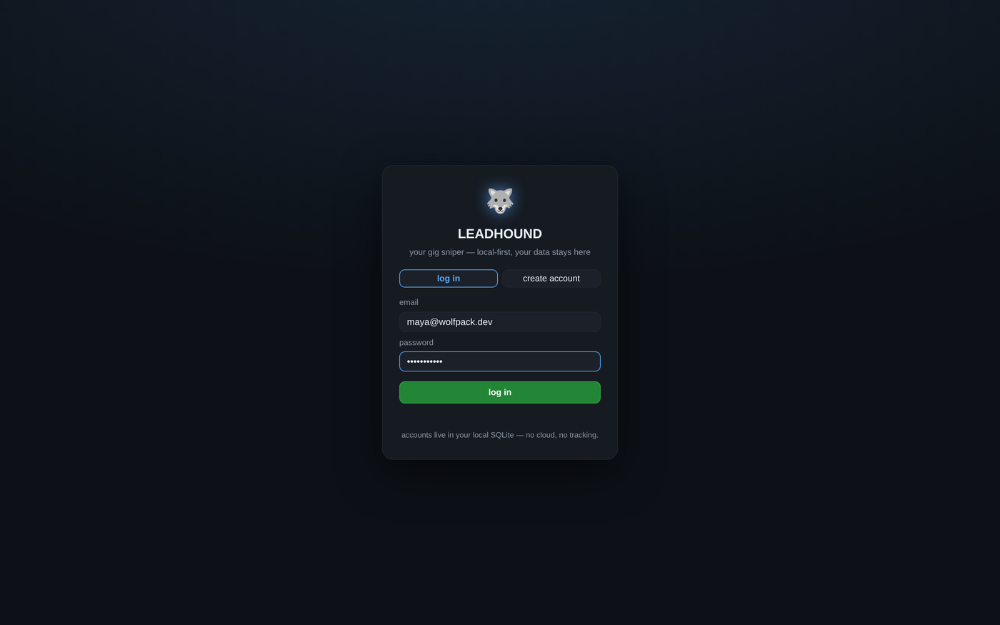
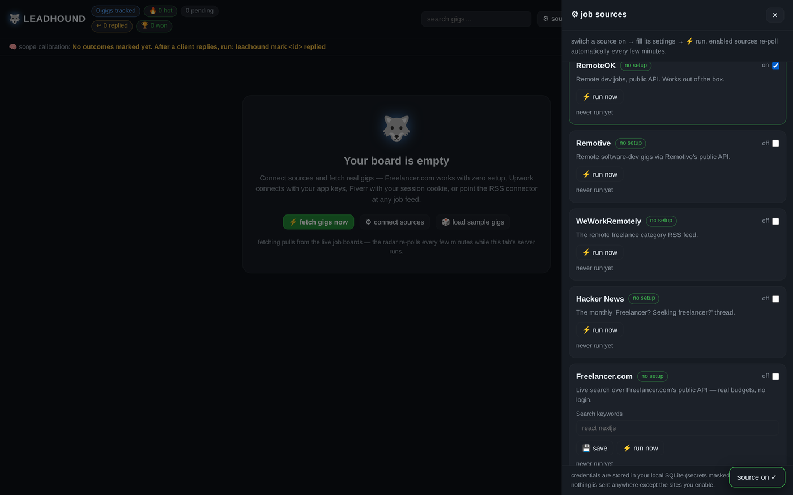
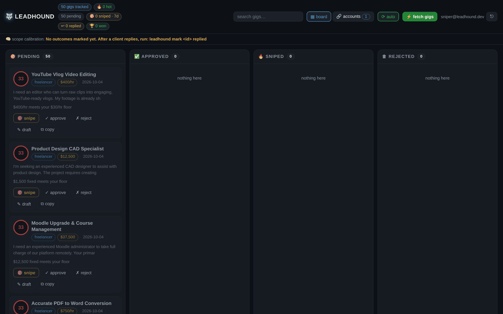
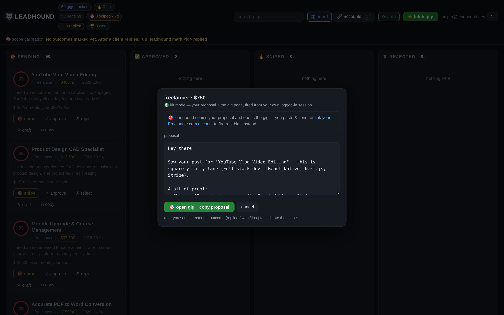

<div align="center">

# 🐺 leadhound

**The gig sniper.** Watches freelance job boards 24/7, scores every gig against
*your* profile, drafts the proposal **in your voice** — and when you say go, it
fires with **your own account**: a real bid on Freelancer.com, or a one-click
snipe kit everywhere else.

*In freelancing, speed wins. The first five proposals on a fresh gig get
disproportionate replies. leadhound makes sure you're always among them —
even at 3am.*


<em>log in → ⚙ connect your job sites → gigs land on the board, scored and
drafted → ✎ review, ✓ approve, 📋 copy. The radar keeps hunting while you sleep.</em>

[](https://github.com/e2sy/leadhound/actions/workflows/ci.yml)
[](https://github.com/e2sy/leadhound/releases/latest)
[](LICENSE)
[](pyproject.toml)
[](pyproject.toml)
[](CONTRIBUTING.md)

**local-first · login system · 8 job-site connectors + account link · live-fire sniping · REST API (FastAPI) ·
native binaries for Windows / macOS / Linux**

**[Quickstart](#-quickstart--three-ways-to-run-it) · [Usage](#-usage--every-way-to-drive-it) · [Sources](#-sources--connect-the-job-sites) · [Snipe mode](#-snipe-mode--fire-with-your-account) · [How it works](#-how-it-works) · [REST API](#-rest-api) · [FAQ](#-faq) · [Author](#-author)**

<sub><b>designed & built by <a href="https://github.com/e2sy">Mayank Bhaskar</a></b></sub>

</div>

---

## ⚡ Quickstart — three ways to run it

### 1. 🖱️ Double-click (no Python needed)

**Download the binary for your OS from [Releases](https://github.com/e2sy/leadhound/releases/latest) and double-click it.** That's the app:

> it self-sets-up → your browser opens the dashboard → **create your account** →
> open **⚙ sources**, switch on Freelancer.com (zero setup) → hit **⚡ fetch gigs**.
> Real gigs land on the board in seconds, and the radar re-polls every few minutes.

Windows shows a SmartScreen note on unsigned binaries — *More info → Run anyway*.

<p align="center">
  
</p>

### 2. 📦 pip (recommended for daily use)

```bash
pip install leadhound        # or: pipx install leadhound
leadhound init               # creates ~/.leadhound with config + your sniper profile
leadhound web                # the app: login → connect sources → fetch → snipe
```

### 3. 🧑‍💻 from source (development)

```bash
git clone https://github.com/e2sy/leadhound && cd leadhound
pip install -e .
leadhound web --port 7800
```

> Prefer offline first? The ⚙ panel has a **🎲 load sample gigs** button and the CLI has
> `leadhound demo` — a full board with red-flag traps, no network needed.

## 🎮 Usage — every way to drive it

**The dashboard** (`leadhound web`) is the main cockpit — kanban board, live search,
in-browser draft editor, accounts hub, background radar. Everything below is optional
and drives the same pipeline:

| Command | What it does |
|---|---|
| `leadhound web` | the app — login, connect sources, approve from the board |
| `leadhound watch` | poll every configured job feed once, score + draft what's new |
| `leadhound watch --loop` | keep watching on an interval |
| `leadhound watch --min-score 80` | only the cream |
| `leadhound queue` | review the approval queue: approve / reject — drafts ready |
| `leadhound digest` | morning briefing: the best gigs from the last 24h |
| `leadhound telegram` | push gig cards to your phone |
| `leadhound webhooks` | push gig cards to Discord / Slack |
| `leadhound demo` | inject sample gigs (incl. red-flag traps) to test the flow |
| `leadhound doctor` | pre-flight check: config, profile, feeds, db |
| `leadhound profile learn e2sy` | scan your GitHub, auto-tune the skills list |
| `leadhound export --format csv` | your pipeline, out to a spreadsheet |
| `leadhound mark 42 won` | record outcomes — the scope learns 🐺 |
| `leadhound --version` | print the version |

A typical morning: `leadhound digest` with coffee → `leadhound queue` → approve the
three gigs worth your time → drafts open in your editor → you send them. Total: 10 minutes.

## 😩 The problem

Freelance job hunting is a *speed game played while you sleep*:

- Best gigs get 30+ proposals within hours — late proposals are noise
- Checking five boards manually, five times a day, doesn't scale
- 90% of posted gigs don't fit your stack or insult your rate — but you read them all anyway
- Writing a fresh, non-generic proposal for the one gig that *does* fit takes 20 minutes you don't have

leadhound replaces all of that with one local watcher that never sleeps and a voice engine that never writes generic fluff.

## 🔌 Sources — connect the job sites

The **🔗 accounts** tab is where the hunting happens. Every job site gets a card with its connection state (✅ connected · ❌ error · ⚠ setup needed · ⚫ off), its last sweep (+ how many new gigs, or the real error), inline settings and a **⚡ save & test** probe. Enabled sources re-poll automatically every `interval_minutes` while the app runs — the accounts page shows the radar's live heartbeat.

<p align="center">
  
</p>

| Connector | Setup | What you get |
|---|---|---|
| **Freelancer.com** | none — public API, optional search keywords | Live project search with real budgets |
| **RemoteOK** | none — public API | Remote dev jobs |
| **Remotive** | none — public API | Remote software-dev gigs |
| **WeWorkRemotely** | none — RSS | The remote freelance category |
| **Hacker News** | none — public Algolia API | The monthly "Freelancer? Seeking freelancer?" thread |
| **Upwork** | your free [dev-app keys](https://www.upwork.com/developer/applications) → 🔗 connect | Official OAuth2 flow, auto-refreshed token, real job search |
| **Fiverr** *(beta)* | your session cookie | Buyer requests, read-only, from your own logged-in session |
| **Custom RSS / Atom** | any feed URL | Niche boards, Upwork/Fiverr RSS mirrors, agency feeds — anything |
| **Freelancer.com account (snipe)** | your free [dev-app keys](https://www.freelancer.com/developers/applications) → 🔗 connect | Official OAuth2 account link — arms 🎯 live-fire bids on every Freelancer.com gig. Never fetches gigs; fires shots. |

Credentials live in your local SQLite, masked in the UI (`•••`) and never sent anywhere except the site you're connecting to. Fiverr is labeled beta honestly: they have no public API, so if their page layout changes, the connector says so instead of pretending.

## 🔥 Snipe mode — fire with YOUR account

v0.7.0 closes the loop: finding gigs was half the job — **firing the shot is the other half**, and now leadhound does it with you:

<p align="center">
  
</p>

Every pending/approved card has a **🎯 snipe** button. The fire dialog knows two honest modes:

| Mode | When | What happens |
|---|---|---|
| **🔥 live-fire** | Freelancer.com gig + your linked account | A **real bid** is placed on Freelancer.com via their official API with your own token — you set the amount and delivery period, hit fire, and the platform bid id lands in your board's audit trail. This is your account, your trigger, on the books. |
| **🎯 snipe kit** | every other source (Upwork, Fiverr, RSS, HN, …) | Your proposal goes into an editable textarea. One click copies it and opens the gig page in your own logged-in browser session. You paste, you send, you tap *"✓ sent it"* — the shot is recorded honestly. (Upwork's API doesn't let third-party apps submit proposals; Fiverr has no API at all. We won't pretend otherwise.) |

Link your Freelancer.com account in the accounts hub: create a free dev app at [freelancer.com/developers](https://www.freelancer.com/developers/applications), paste the keys, hit 🔗 connect — same two-minute OAuth flow as Upwork. The card shows `linked as @you`, and every Freelancer.com gig becomes live-fire.

Every sniped card tracks the outcome (↩ replied · 🏆 won · ✗ lost) — the scope calibrates on real results, and the chips show your 7-day fire rate and reply rate.

<p align="center">
  
</p>

## 🎯 How it works

```
[SOURCES/CONNECTORS] ──>  [PARSER]  ──>  [SCORER]  ──>  [VOICE ENGINE]
  Freelancer.com,           extract        fit score       proposal draft
  RemoteOK, Remotive,       skills,        0-100 +         in YOUR voice,
  WWR, HN, Upwork (OAuth),  money,         breakdown       with YOUR proof
  Fiverr, any RSS           red flags      ("why 92?")     bullets + tone
                                                                 |
                                                  [API + DASHBOARD + NOTIFIERS]
                                                  FastAPI · kanban board ·
                                                  Telegram / Discord / Slack
                                                  you tap. you send.
```

| Stage | What it does |
|---|---|
| **Watchers / Connectors** | Pluggable sources. Zero-config: WeWorkRemotely (RSS), RemoteOK, Remotive, Hacker News, Freelancer.com (public APIs). Bring-your-own: Upwork (official OAuth2), Fiverr (session cookie, beta), any RSS/Atom feed. |
| **Parser** | Regex signal extraction: money (hourly / fixed / ranges), client-quality signals (payment verified, past hires, top-rated), red flags, skill matching. |
| **Scorer** | `skills 0-60 · budget 0-25 · client quality 0-15 · red flags -15 each`. Every gig ships with a human-readable breakdown: *"58 — matched react, typescript; no budget stated (neutral)"*. |
| **Voice engine** | Template mode works with zero config. Or plug any OpenAI-compatible endpoint (OpenAI, Groq, OpenRouter, local Ollama) and it ghostwrites in your tone, trained on your past winning proposals. |
| **Approval queue** | Rich CLI queue or Telegram/Discord/Slack cards, or the 🎯 snipe button on the dashboard. **You pull the trigger** — live-fire bids are user-clicked only, kit snipes are user-confirmed. leadhound is a radar + copilot, *not* a background auto-bidder. |
| **Client intel** | Cross-references your own gig history: repeat posters and repeat lowballers get flagged before you spend a minute on the draft. |
| **Learning loop** | `leadhound mark <id> won/lost/replied` → stats calibrate: winners vs losers by score, with hints to tighten your scope. The tool gets sharper the longer you hunt. |
| **Web dashboard** | `leadhound web` — a login-protected kanban board of your pipeline: create an account, connect job sites in the accounts tab (setup wizards included), fetch gigs, drag pending → approved → sent, edit drafts in-browser, mark outcomes, live search. Accounts, sessions and per-source configs are stored locally in SQLite. Binds to 127.0.0.1 (or `--host 0.0.0.0` to drive it from your phone). |
| **GitHub recon** | `leadhound profile learn <you>` — scans your public repos, ranks the languages/topics you actually ship, and merges them into your skills list. Zero-config personalization. |
| **Data export** | `leadhound export --format csv\|json` — your whole gig history as clean rows for spreadsheets, scripts or your CRM. No lock-in. |

## 🔌 REST API

The dashboard is backed by a real REST API (FastAPI). Run the app and open [`/docs`](http://127.0.0.1:7800/docs) for the interactive OpenAPI schema:

```
POST /api/auth/register · login · logout        session cookies (HttpOnly, SameSite=Lax)
GET  /api/state                                 board + stats + calibration + snipe stats
POST /api/status · /api/draft · /api/outcome    pipeline mutations
GET  /api/jobs/{id}/snipe-plan                  how this gig can be sniped (api vs kit)
POST /api/jobs/{id}/snipe                       fire: real bid via the linked account
POST /api/jobs/{id}/snipe-confirm               kit send confirmed by the user
GET  /api/connectors                            all sources + per-account config
POST /api/connectors/{id} · {id}/run            configure / fetch a source now
POST /api/fetch                                 fetch every enabled source now
GET  /api/health                                liveness + version
```

Every board route is account-scoped, and a background radar re-runs enabled connectors every `interval_minutes` (floor: 5) — the sniping works while you sleep.

## 🛡️ ToS-safe by design

Platforms ban bots that log in, scrape logged-in pages, and auto-send. leadhound is built around that line:

- ✅ Zero-config sources read **public** feeds/APIs only, with a polite `User-Agent`
- ✅ **Upwork** uses the *official* OAuth2 API with keys from your own developer app — no scraping, ever
- ✅ **Freelancer.com live-fire** bids go through their *official* API with **your own token** — placed only when **you** click 🎯 snipe, never in the background, bid id recorded on your board
- ✅ Polls at **human-rate** intervals (default 15 min, hard floor 5)
- ✅ Snipe-kit sends happen in **your own browser session** — leadhound prepares the ammo, you pull the trigger
- ⚠️ The Fiverr (beta) connector reads buyer requests from **your own logged-in session cookie**, read-only, nothing auto-sent — it exists because Fiverr has no API. Use your judgment; if that's too spicy for you, skip that connector.
- ❌ No background auto-bidding, no headless-browser scraping, no account automation

It makes you faster — not banned.

## 📱 Telegram in 2 minutes

1. Talk to [@BotFather](https://t.me/BotFather) → `/newbot` → copy the token
2. Message your bot once, then open `https://api.telegram.org/bot<TOKEN>/getUpdates` → copy `chat.id`
3. Fill `[telegram]` in `~/.leadhound/config.toml`, set `enabled = true`

Now every gig above your threshold buzzes your pocket with the draft attached — approve on your phone, send from your laptop.

Prefer Discord or Slack? Drop a webhook URL into `[webhooks]` in `config.toml` and the same gig cards land in your server the moment the watcher sees them.

## 🧠 LLM voice mode (optional)

```toml
[llm]
enabled = true
base_url = "https://api.groq.com/openai/v1"   # or OpenAI, OpenRouter, Ollama
api_key = "gsk_..."
model = "llama-3.3-70b-versatile"
```

Drop 1-3 of your past winning proposals into `profile.toml → tone_samples`.
The ghostwriter copies your structure and tone, capped at 150 words, and is
forbidden from inventing experience. If the API fails, it silently falls back
to template mode — the pipeline never breaks.

## ⚙️ Configuration reference

| File | Purpose |
|---|---|
| `~/.leadhound/profile.toml` | **Your sniper profile**: skills, rate floors, red flags, proof bullets, tone samples. The scorer is only as sharp as this file. |
| `~/.leadhound/config.toml` | Watch settings (`min_score`, `interval_minutes`, `sources`), optional LLM + Telegram. |
| `~/.leadhound/data/leadhound.db` | SQLite. Your entire gig history, local-only, yours. |

See [`examples/profile.example.toml`](examples/profile.example.toml) for a filled-in profile.

## 🚀 Extending: add a watcher in 30 lines

```python
# leadhound/watchers/mysource.py
def mysource() -> list[dict]:
    ...
    return [{
        "guid": "unique-id", "source": "mysource",
        "title": "...", "url": "...", "body": "...", "tags": ["react"],
    }]
```

Register it in `SOURCES`, and the parser, scorer, queue, and Telegram pick it up automatically. Full guide: [CONTRIBUTING.md](CONTRIBUTING.md).

## ❓ FAQ

<details>
<summary><b>Is this against Upwork's ToS?</b></summary>

leadhound's Upwork connector uses Upwork's *official* OAuth2 API with keys from your own free developer app — the sanctioned path, no scraping. The zero-config sources read public job-board feeds and help you *prepare* — the same as an RSS reader plus a notepad. You manually open the gig and personally send your proposal. That's what "ToS-safe by design" means; see the section above.
</details>

<details>
<summary><b>Why not a background auto-bidder?</b></summary>

Because unattended auto-bidders get accounts banned and clients spammed with slop. v0.7.0 goes as far as a platform officially allows: on Freelancer.com, the 🎯 snipe button places a **real bid through the official API with your own token** — but only when you click, with the amount and proposal you confirmed. On platforms without such an API (Upwork, Fiverr), the snipe kit prepares everything and you pull the trigger in your own session. The tool removes the *searching* and the *blank page*; the judgment — and the trigger — stay yours.
</details>

<details>
<summary><b>Does my data leave my machine?</b></summary>

No. Jobs, scores, and drafts live in a local SQLite file. The only outbound calls are to the job feeds you configured, plus the LLM/Telegram endpoints *if* you opt in.
</details>

<details>
<summary><b>How is this different from a job-alert email?</b></summary>

Alerts email you raw posts, all of them, eventually. leadhound scores every gig against your personal profile the minute it appears, filters out the 90% you'd skip, and hands you a ready-to-edit draft for the rest — with a score breakdown explaining every decision.
</details>

<details>
<summary><b>Windows / macOS / Linux?</b></summary>

Anything with Python 3.11+ — or grab a native one-file binary (Windows `.exe`, macOS, Linux) straight from the [releases page](https://github.com/e2sy/leadhound/releases/latest): download, run, done.
</details>

## 🗺️ Roadmap

- [x] Learning loop — track which proposals get replies, calibrate the scope (`leadhound mark` + stats hints)
- [x] HN "freelancer wanted" source (public Algolia API)
- [x] Discord + Slack webhook notifications
- [x] Native one-file builds (Windows `.exe` / macOS / Linux) — attached to every release
- [x] Web dashboard — local kanban pipeline board + in-browser draft editor (`leadhound web`)
- [x] `leadhound profile learn` — auto-tune your skills from your public GitHub
- [x] `leadhound export` — CSV/JSON of the whole pipeline
- [x] **Real backend** — FastAPI REST API, login system, per-account data
- [x] **Source connectors** — Freelancer.com, Upwork (OAuth2), Fiverr (beta), custom RSS
- [x] **Accounts hub** — connection state, setup wizards, save & test probing, radar heartbeat
- [ ] Hosted SaaS mode — same core, multi-tenant cloud deploy (the account + connector schema is already shaped for it)
- [ ] Proposal A/B testing — two drafts, track which tone wins
- [ ] Agency mode — monitor a bench of freelancer profiles

Check the [open issues](https://github.com/e2sy/leadhound/issues) to grab something.

## 🤝 Contributing

PRs welcome — especially new watchers and scorer improvements. Read [CONTRIBUTING.md](CONTRIBUTING.md) first; the ToS-safe ground rules there are hard requirements, not vibes. CI runs ruff + pytest on Python 3.11/3.12/3.13.

## ⚠️ Honesty section

A tool that gets you seen faster is not a tool that gets you hired — your work still has to close the deal. leadhound buys you speed and focus; it doesn't buy skill.

## 👤 Author

<div align="center">

**leadhound is designed, built and maintained by [Mayank Bhaskar](https://github.com/e2sy).**

<a href="https://github.com/e2sy">
  
</a>
<a href="https://github.com/e2sy/leadhound/issues">
  
</a>

</div>

## License

[MIT](LICENSE) © Mayank Bhaskar — do whatever, just don't blame the dog.

<div align="center">

If leadhound won you a gig, a ⭐ helps other freelancers find it.

<sub>🐺 leadhound — built by Mayank Bhaskar · local-first, ToS-safe, always hungry</sub>

</div>
